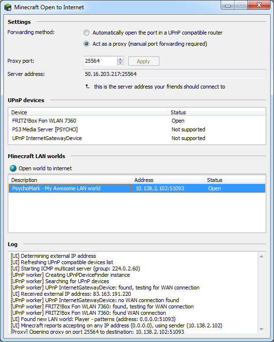

# Minecraft Open to Internet
This useful little utility I wrote back in 2012 should still work! It is written in Delphi, XE2 I believe. It seems to use Indy, Jedi VCL, OmniThread library and VirtualTree, as well as my own [X2Utils](https://github.com/MvRens/x2utils).

It's be a shame to lose this work, even though I no longer work with Delphi, so I'm publishing this as open-source under The Unlicense.

The original post from the old minecraftforum, which is also available on the [web archive](https://web.archive.org/web/20170728075532/http://www.minecraftforum.net:80/forums/mapping-and-modding/minecraft-tools/1264164-minecraft-open-to-internet-v0-5):

Hey everyone,

I love the "Open to LAN" option in Minecraft but wanted to use it to continue playing over the internet. I searched high and low, and even a bit in the middle, but couldn't find an easy way to do it without setting up a VPN. So, I wrote a small utility and figured, I got so much out of Minecraft Forums, why not sign up and give back a little.

**What does it do?**

It searches your LAN for open Minecraft worlds much like the Multiplayer screen in-game does. If it finds one, you can open it to the internet on a fixed port, making it possible for your friends to use "Add server" to connect.

To actually open the port it uses UPnP to tell your router where to forward the data, since Minecraft LAN worlds use a different port each time they are opened.

Since version 0.4 you can also use the "Act as a proxy" option if you're having problems with UPnP. In that case MinecraftO2I does **not** automatically forward the port, but will accept connections on the configured port so you can can open that port on your router manually. All traffic will be redirected to the selected LAN world's dynamic port.

...and don't worry, even if I wanted to, the data going through the proxy does _not_ include anything interesting like your Minecraft login. It's passed through without interpretation.

**Screenshot**

**So how do I use it?**

In the ZIP file is a single .exe file. Extract it somewhere; in your Minecraft folder, desktop, doesn't matter where, and run it.

_Automatic forwarding using UPnP_
In the "Port forwarding (UPnP)" box your modem/router appears. If it doesn't you probably need to enable UPnP support. On my Fritzbox the option is under "Internet - Permit Access - Allow changes to security settings over UPnP".

_Manual forwarding using the proxy_
Select the "Act as a proxy" option. In your router's configuration, forward the port specified in the "Proxy port" setting to the computer running MinecraftO2I.

Now, open up Minecraft, load up your world and use Open to LAN. Switch back to Minecraft Open to Internet and your world shows up in the list at the bottom. Select your world and click "Open world to internet". Your friends should now be able to connect to the Server address shown at the top.

If you don't want to switch out of Minecraft and manually open the world, enable the option "Automatically open the first LAN world to the internet" and MinecraftO2I will do that for you as soon as you click "Open to LAN" in Minecraft.

**Awesome. Download?**

Version 0.5.2: [32 bits](https://bin.x2software.net/minecraft02i/MinecraftO2I-0.5.2-x86.zip) | [64 bits](https://bin.x2software.net/minecraft02i/MinecraftO2I-0.5.2-x64.zip)

Most modern computers are 64-bits. If you're not sure which version you need, download the 32-bits version; it'll work just fine on 64-bits computers.

**Got a Mac version?**

Not natively or supported by me, but kingofants (who came up with the proxy idea; thanks!) reported that it does work with WineBottler provided you use the proxy option. UPnP does not seem to work.

An alternative is to run MinecraftO2I on a spare Windows machine; it doesn't have to be the same machine on which Minecraft is running, as it can open any world on your LAN.

Older versions:

A full list of older versions is available at [http://bin.x2software.net/minecraft02i/](http://bin.x2software.net/minecraft02i/)

I have also added them to this repository in the releases folder, in case the link above goes down.

**Changelog**

Version 0.5.2

-   The provider externalip.net, used to report the Server address, is no longer availabe. Replaced it with my own;  [http://api.x2software.net/ipv4](http://api.x2software.net/ipv4)

Version 0.5.1

-   Minimizing and restoring the window no longer doubles it's width

Version 0.5

-   Added an option to automatically open the first LAN world (no need to switch out of Minecraft)
-   Log is now hidden by default

Version 0.4

-   Added the proxy option
-   64-bits build

Version 0.3

-   Added support for Minecraft 1.6 (which only reports the port number)

Version 0.2

-   Added support for Minecraft 1.4.4+ (which reports LAN IP address 0.0.0.0)
-   Fixed an Invalid Pointer Operation when UPnP devices update
-   The External port is now saved when you restart MinecraftO2I
-   Added a log to hopefully get more info when the port forwarding doesn't work

**Known issues**

-   If you have 2 routers and one won't accept the request to open a port, the Worlds list might incorrectly show "LAN only". In that case, please refer to the UPnP status column for the actual status.
-   Changing the port after a world has opened does not work. Simply restart MinecraftO2I.